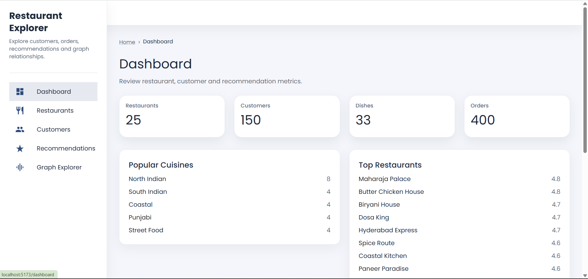
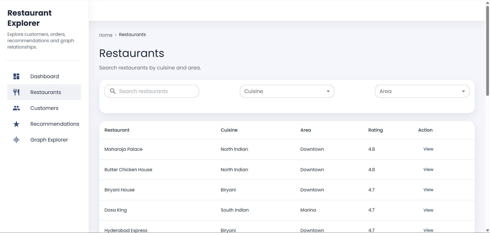
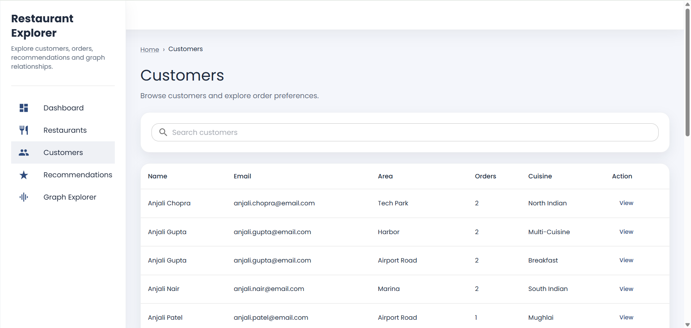
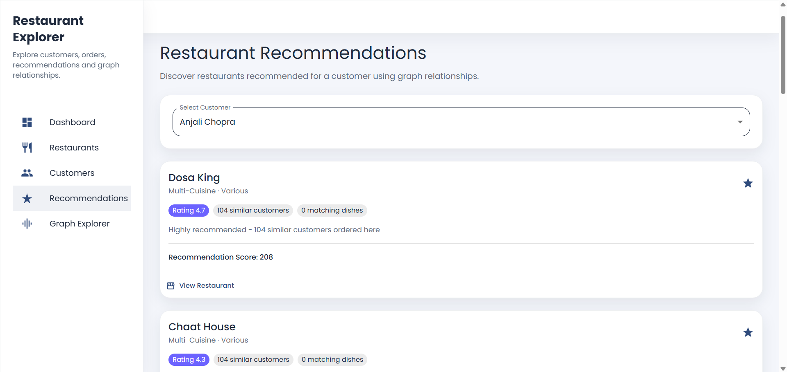
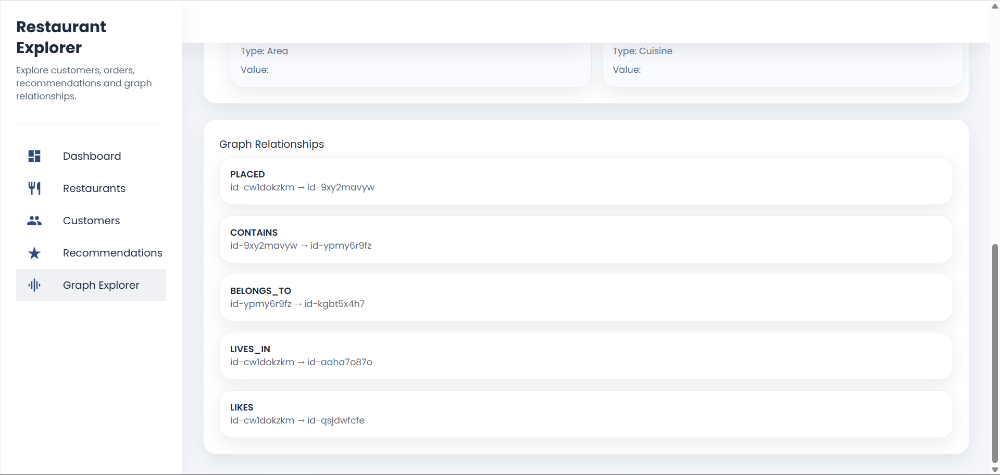

# Restaurant Relationship & Recommendation Explorer — Frontend

## Overview

A modern React frontend for exploring restaurants, customers, recommendations, and graph relationships. This application is built with Vite, React, Material UI, Axios, and React Router.

## Features

- Dashboard with restaurant, customer, dish, and order metrics
- Restaurant listing with search, cuisine filter, area filter, and pagination
- Restaurant details page with ratings, dishes, and location
- Customer directory with search and pagination
- Customer profile page with purchase history and recommendation navigation
- Restaurant recommendation page driven by customer selection
- Graph explorer for customer relationships across orders, dishes, restaurants, and areas
- Loading, empty, and error states for all API workflows

## Technology Stack

- React
- Vite
- JavaScript
- Material UI (MUI)
- React Router
- Axios
- React Hooks

## Project Structure

```
src/
 ├── assets/
 ├── components/
 │   ├── common/
 │   ├── dashboard/
 │   ├── restaurants/
 │   ├── customers/
 │   ├── recommendations/
 │   └── graph/
 ├── layouts/
 ├── pages/
 ├── routes/
 ├── services/
 ├── theme/
 └── App.jsx
```

## Environment Variables

Create a `.env` file in the project root with:

```
VITE_API_URL=http://localhost:5000/api
```

## Backend API Configuration

The frontend communicates with the backend via the configured `VITE_API_URL` environment variable. It does not connect directly to any database.

## Installation

```bash
npm install
```

## Running Locally

```bash
npm run dev
```

## Build

```bash
npm run build
```

## API Endpoints Used

- GET `/api/health`
- GET `/api/dashboard`
- GET `/api/restaurants`
- GET `/api/restaurants/:id`
- GET `/api/customers`
- GET `/api/customers/:id`
- GET `/api/customers/:id/purchases`
- GET `/api/customers/:id/recommendations`
- GET `/api/graph/customer/:id`

## Screenshots

Screenshots can be added here once the application is running locally or deployed.








<!-- Graph Explorer -->
